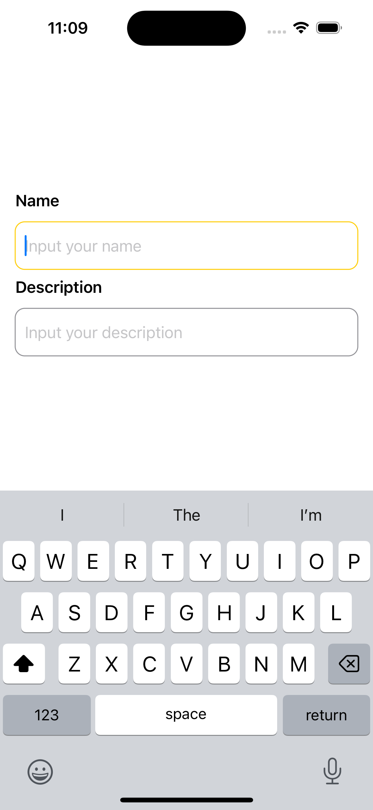
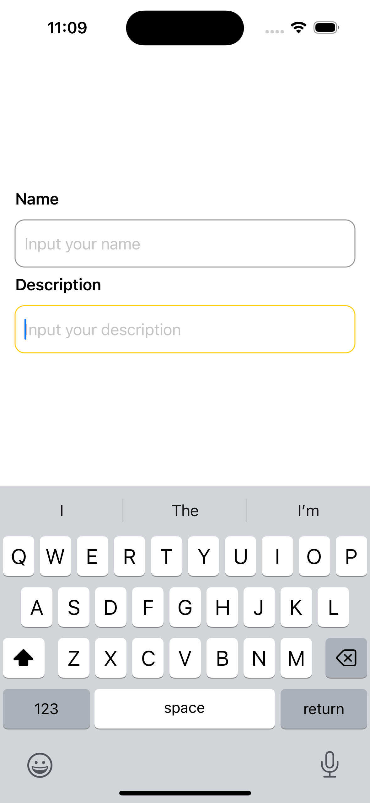

# SwiftUI Focused TextField

This is a sample project demonstrating how to create a Focused TextField in SwiftUI.

## Screenshots

     
     

## Requirements

- iOS 15.0+
- Xcode 13.0+
- Swift 5.5+

## Installation

1. Clone the repository
2. Open the project in Xcode
3. Build and run the project on your simulator or iOS device

## Usage

Simply open the project and run it. Tap on the TextField to see the yellow border appear.

## License

[MIT License](LICENSE)
